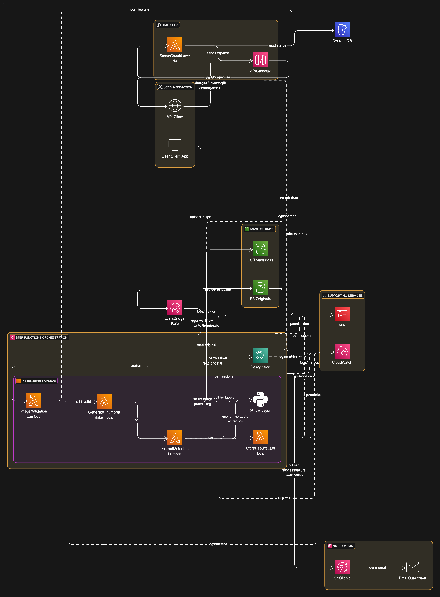

# Event-Driven Serverless Image Processing Pipeline on AWS

## Introduction / Overview

This project implements a scalable, event-driven, serverless pipeline built entirely on Amazon Web Services (AWS) for automated image processing. When an image is uploaded to a designated S3 bucket, this pipeline automatically validates the image format, generates multiple thumbnail sizes, extracts comprehensive metadata (including basic image properties and AI-driven content labels using Amazon Rekognition), stores this information in Amazon DynamoDB, and sends notifications upon completion or failure.

The entire infrastructure is defined and deployable as code using the AWS Serverless Application Model (SAM), showcasing best practices for managing serverless applications. An HTTP API endpoint built with Amazon API Gateway is also included to check the processing status and retrieve metadata for any processed image.

This project serves as a practical example of building robust, automated, and scalable backend systems in the cloud.

## Features

* **Event-Driven Architecture:** Processing is automatically triggered by image uploads to Amazon S3.
* **Serverless Compute:** All processing logic is handled by AWS Lambda functions
* **Workflow Orchestration:** AWS Step Functions manages the multi-step processing workflow, including error handling, state transitions, and notifications.
* **Image Validation:** Validates uploaded files against supported image formats (JPG, PNG, JPEG).
* **Automated Thumbnail Generation:** Creates multiple thumbnail sizes (e.g., 100x100, 640x480) using the Pillow library (via Lambda Layer).
* **Comprehensive Metadata Extraction:**
    * Basic image properties (dimensions, format, filesize, color mode) via Pillow (via Lambda Layer).
    * Content-based labels and confidence scores using Amazon Rekognition.
* **Persistent Metadata Storage:** Stores original image references, thumbnail S3 locations, and all extracted metadata in an Amazon DynamoDB table.
* **Notifications:** Uses Amazon SNS to send human-readable notifications (to an email address) upon successful completion or failure of the processing workflow, using a single topic with message attributes to differentiate status.
* **API for Status Check:** An HTTP API endpoint built with Amazon API Gateway allows querying the processing status and metadata of any image by its filename.
* **Infrastructure as Code (IaC):** The entire cloud infrastructure is defined in an AWS SAM template (`template.yml`)

## Architecture

The pipeline is initiated when an image is uploaded to the `uploads/` prefix in a designated S3 bucket. This S3 `ObjectCreated` event is captured by an Amazon EventBridge rule, which is configured to trigger an AWS Step Functions state machine.

The state machine then orchestrates a sequence of AWS Lambda functions:
1.  **ImageValidationLambda:** Validates the image format.
2.  **GenerateThumbnailsLambda:** Creates thumbnails and stores them in a separate S3 "thumbnails" bucket.
3.  **ExtractMetadataLambda:** Extracts basic properties using Pillow and performs content analysis using Amazon Rekognition for labels.
4.  **StoreResultsInDynamoDBLambda:** Writes all collected information to a DynamoDB table using the S3 key as the primary identifier (`ImageKey`).

Upon successful completion or any failure during these steps, the Step Function publishes a notification to an SNS topic.

A separate Amazon API Gateway HTTP API endpoint (`GET /images/uploads/{filename}/status`) invokes a `StatusCheckLambda` to query the DynamoDB table and return the status and details of a processed image.



## Technologies & AWS Services Used

* **Core AWS Services:**
    * Amazon S3
    * AWS Lambda 
    * AWS Step Functions
    * Amazon DynamoDB
    * Amazon SNS (Simple Notification Service)
    * Amazon EventBridge
    * Amazon API Gateway (HTTP API)
    * Amazon Rekognition
    * AWS IAM (Identity and Access Management)
    * Amazon CloudWatch (Logs & Metrics)
* **Infrastructure as Code:**
    * AWS SAM (Serverless Application Model)

* **Programming Language & Key Libraries (Lambda):**
    * Python
    * Pillow (for image manipulation, provided via Klayers Lambda Layer)
    * Boto3 (AWS SDK for Python)
* **Development & Testing Tools:**
    * Git & GitHub 
    * Docker (for `sam build --use-container`)
    * Postman (or `curl`, for API testing)

## Prerequisites

To deploy and run this project, you will need:
* An AWS Account.
* AWS CLI installed and configured with necessary permissions
* AWS SAM CLI installed.
* Docker installed and running (required for `sam build --use-container`).


## Deployment with AWS SAM

1.  **Clone the repository:**
    ```bash
    git clone https://github.com/Harbeylefty/Image-Processing-Project.git
    cd image-processing-pipeline 
    ```
2.  **Navigate to the SAM application directory:**
    ```bash
    cd infrastructure/sam/
    ```
3.  **Build the SAM application:**
    This command builds Lambda function dependencies inside a Docker container that mimics the AWS Lambda environment.
    ```bash
    sam build --use-container
    ```
4.  **Deploy the SAM application:**
    The first time you deploy, use the `--guided` flag to specify deployment parameters.
    ```bash
    sam deploy --guided
    ```
    You will be prompted for:
    * **Stack Name:** Choose a name for your CloudFormation stack (e.g., `ImageProcessingPipeline`). This needs to be unique in your AWS account and region for new stacks.
    * **AWS Region:** Your desired AWS region.
    * **Confirm changes before deploy:** Enter `Y` to review changes.
    * **Allow SAM CLI IAM role creation:** Enter `Y`.
    * **Disable rollback:** Enter `N` (allows CloudFormation to roll back to the previous stable state if the deployment fails).
    * **Save arguments to configuration file `samconfig.toml`?:** Enter `Y`.
    * Accept defaults for other prompts

5.  **SNS Email Subscription Confirmation:**
    After the stack is successfully deployed, an email will be sent from AWS Notifications to the address specified in `template.yml` for the SNS subscription. **You MUST click the confirmation link in this email** to activate the subscription and start receiving notifications from the `ImageProcessingNotifications` topic.

For subsequent deployments after making changes to your template or Lambda code, you can often just run `sam deploy`

## Usage & Testing the Pipeline

### Triggering the Pipeline
1.  Navigate to the AWS S3 console.
2.  Go to the S3 bucket created by SAM for uploads.
3.  Upload a valid image file (e.g., a `.jpg` or `.png`) **into the `uploads/` prefix (folder)**. You can do this by:
    * Using the "Create folder" button in the S3 console to create an `uploads` folder, then navigating into it and clicking "Upload".
    * Or, during the upload process, ensuring the destination "Key" for your image is `uploads/your-image-name.jpg`.

### Expected Outputs & Verification
* **Step Functions:** Monitor the execution in the AWS Step Functions console for the state machine (e.g., `ImageProcessingWorkflow`). Look for a successful (all green) execution.
* **Thumbnails:** Check the S3 bucket for thumbnails (e.g., `thumbnails-bucket-us-east-1-20251`) inside its `thumbnails/` prefix.
* **DynamoDB:** Verify a new item with the image's metadata and thumbnail details is created in the `ImageProcessingDb` table. The `ImageKey` will be the full S3 key (e.g., `uploads/your-image-name.jpg`).
* **SNS Notification:** Check your configured email for a success or failure notification from the `ImageProcessingNotifications` topic.

### Using the Status Check API
1.  **Find your API Gateway Invoke URL:**
    * After `sam deploy` completes successfully with the API defined, check the "Outputs" section of your CloudFormation stack in the AWS console for an output named `ImageStatusApiEndpoint`.
    * Alternatively, navigate to API Gateway in the console, find your HTTP API (e.g., `ImageStatusAPI`), go to "Stages," select the `$default` stage, and copy the "Invoke URL."
2.  **Construct the API request URL:**
    The endpoint structure is `GET <InvokeURL>/images/uploads/{filename}/status`.
    Replace `<InvokeURL>` with your actual API invoke URL and `{filename}` with the name of an image file (e.g., `Kubernetes2.png`) that has been processed.
    Example using `curl`:
    ```bash
    curl https://<your-api-id>.execute-api.<your-region>.amazonaws.com/images/uploads/Kubernetes2.png/status
    ```
3.  **Expected Response:**
    * **200 OK:** With a JSON body containing the image's processing details from DynamoDB.
    * **404 Not Found:** If the image ID (derived from `uploads/filename`) is not found in DynamoDB, with a body like `{"message": "Image details not found for the given image identifier."}`.

## Cleaning Up / Deleting the Stack
To remove all AWS resources created by this SAM application and avoid ongoing charges:
1.  **Empty S3 Buckets:** Manually delete all objects from the `UploadsBucket` and `ThumbNailsBucket` that were created by this stack. CloudFormation cannot delete buckets that contain objects.
2.  **Delete the SAM/CloudFormation Stack:**
    Navigate to your `infrastructure/sam/` directory in the terminal and run:
    ```bash
    sam delete --stack-name <YourStackName> 
    ```
     Confirm the deletion when prompted. Alternatively, you can delete the stack directly from the AWS CloudFormation console.


This project is licensed under the MIT License.